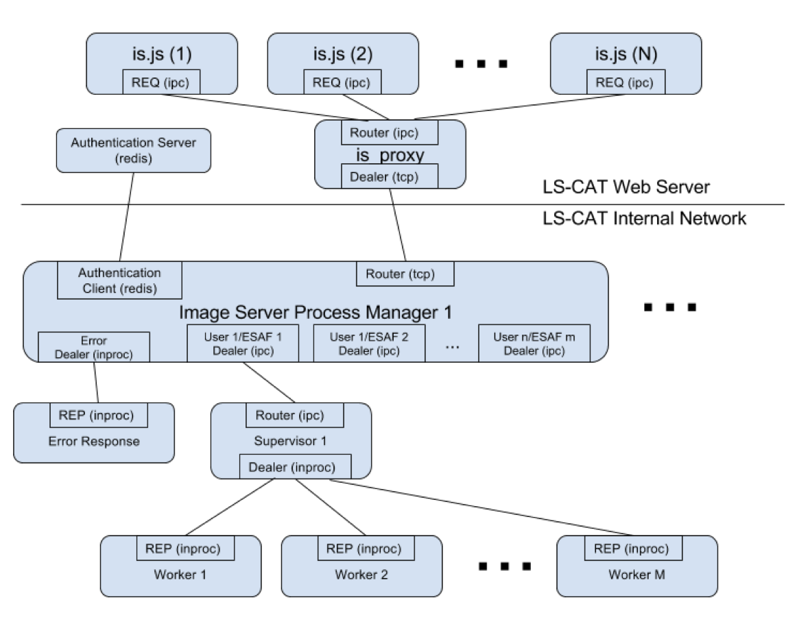

(DEPRECATED) LS-CAT Image Server
================================

Quickstart (Ubuntu 22.04)
-------------------------
Before installation and deployment, please run the following commands to install and configure the Image Server's dependencies:
```
sudo apt install redis-server
sudo systemctl enable redis-server
sudo systemctl start redis-server
sudo apt install libhdf5-dev libjansson-dev libhiredis-dev libzmq3-dev \
  libbz2-dev libtiff-dev libjpeg-dev libturbojpeg-dev
```

After starting a local redis server and obtaining all dependencies, please run the following commands to build and install the Image Server:
```
git clone <this repo>
cd <your clone>
make
sudo make install
```

To deploy the Image Server the way most LS-CAT members expect to use it, please run the following commands:
```
screen -DRR
is
```

Overview
--------

This project, affectionately known as `is` for Image Server, takes
requests regarding diffraction images from the user and returns the
result.  The simplest request is for a jpeg version of a diffraction
image so that the user may view it on their browser.

Here are the main parts:

1. Javascript components running on the user's browser as well as on a
   [node server](https://nodejs.org).  Code for these components are
   found at here https://github.com/ls-cat-org/node.  And while
   we're on this side of things, the program `is_proxy` (found in the
   previously linked git repo) passes along the user
   requests to the image server.

2. Directing requests to processes running under the correct UID/GID.

3. Performing the action and returning the result back up the chain.


We'll go through each of these parts in greater deatil in the
following sections.


Preliminaries
-------------

At LS-CAT information about experiments (called ESAFs here) is
obtained electronically from the APS and this information is used to
set up ESAF accounts which own the collected data and User accounts
that are members of the ESAFs on which the user in question is a
member.

We segregate servers such that machines that are connected to the
outside world do not have user accounts and do not mount file system
that contain our image data.  We do not fully trust these machine,
that is, we assume they've been compromised, so we do not rely on them
to grant access to internal resouces.

Likewise, machines that have user accounts and mount the file systems
which contian our data are not connected directly to the outside
world.  Since they have user accounts we do not rely on them for any
sort of authentication.

Next, we have machines that contain authentication information but do
not have user accounts and are not connected directly to the outside
world.  These machines are allowed to authticate users and grant
access resources.  Since they are still connected to a network they
are not allowed issue certificates that form the baises of trust
amongst the computers at LS-CAT.

Finally, we have a machine that is not connected to anything that we
use to generate X509 certificates and keys used by various computers
at LS-CAT.  One of these uses to allow the database server to sign an
access object used by the web server and the image server to verify
access to resources in spite of us not trusting data stored on the web
server.


Communicating the request and its response
------------------------------------------

We use [ZeroMQ](http://zeromq.org) to handle the messaging.  In
particular, the client (`is.js`) uses a zmq REQ socket and the server
uses a zmq REP socket.  In between these two are zmq Router sockets
which agregate client requests and zmq Dealer sockets which
distribute client requests among the avaiable servers.

ZMQ enforces a rule that every client request must be answered by one
server response: a client must wait for a response before making
another request and a server must respond to a request before
receiving a new one.  For us this means that

1. User generates a request that is handeled by the `is.js` component
   of the LS-CAT Remote Access Server


<!--@image latex isOverview.eps "Image Server Data Flow"-->

1. Request is aggregated by `is_proxy`.  This allows for multiple
   instances of `is.js` (which we have) on possibly multiple web
   servers (which we do not have *yet*).  Note that the location of
   `is_proxy` is well known so that `is.js` and the Image Server
   Process Manager can connect to it.  This obviates the need for a
   more complex discovery mechanism.

1. The Image Server Process Manager receives the request and passes it
   on to a process running as the UID of the user and the GID of the
   ESAF that collected the data.  Note that an error can occur at this
   stage if, say, the user is no longer logged in or requests access
   to a resource that is not authrozied.  In this case an error
   message must be returned the request is passed to a special error
   reponsder.

1. The process supervisor receives the request and passes it on to a
   worker thread.

1. The worker thread performs the work and passes the result back
   through the ZMQ pipes.

At any step an error message will be passed back instead of the result
when something goes wrong as every request must receive a response as
enforced by the ZMQ REQ/REP sockets.

The Image Server Process Manager box illustrated in the diagram parses
the user request to pull out some key information:

 - Experiment Safety Assessment Form (ESAF) number of the experiment
   that collected the data we want to access (from which we develop
   the unix GID).

 - A Process ID (PID) for this session for this user.  This is used to
   ensure the user is still logged in and to look up the following
   additional information needed:

    + User name

    + APS Badge Number (from which we develop the unix UID)

    + A list of allowed ESAFs for this user.

    + A signature we use to ensure that this additional
      information has not been tampered with.

A Note About Permissions and Speedy Access
------------------------------------------

Time is of the essence.  When a user requests something be done with
an image the user is going to run out of patience when it takes longer
than 500 milliseconds.  Hence, we do everything we can to speed things
up including the following:

We create JPEGS in two steps:

 1. Reduce image to the size of the requested JPEG but at the full
    image depth of the source image.  This reduced image is saved for
    future requests and since this step is the most time consuming
    future requests are handled much faster.

 1. Scale the reduced image to 8 bit depth of the JPEG images we'll be
    generating.

There are often multiple users attempting to the same images as jpegs
of the same size.  Hence, by saving the reduced images we only have to
do the time comsuming part of the job once.  So, how do we refer to
the?  We generate a key based on the ESAF, the filename relative to
the ESAF directory, and the size of the jpeg we are requesting.  There
are two ways to save the data:

 1. In a process owned linked list coupled with a hash table.  This is
    very fast but only a single user can access it as the processes
    are run as the UID/GID of the calling user.

 1. In a Redis database.  This is also pretty fast but unlike the
    above linked list the data can be share among all the users of a
    given ESAF.  Since redis saves things in-memory whenever possible
    things are pretty good.

Both of these methods work best when the machine we're running on has
gobs of memory.  The more the merrier.


A Note About Error Handling
---------------------------

In this project all programming and initialization errors are
considered fatal.  Either `assert` is called or a mesage is printed
to syslog and `exit(-1)` is called.

Non-programming errors always result in a error being sent back to the
user via ZMQ and perhaps a message being printed to syslog.

Debugging output is sent to syslog.

